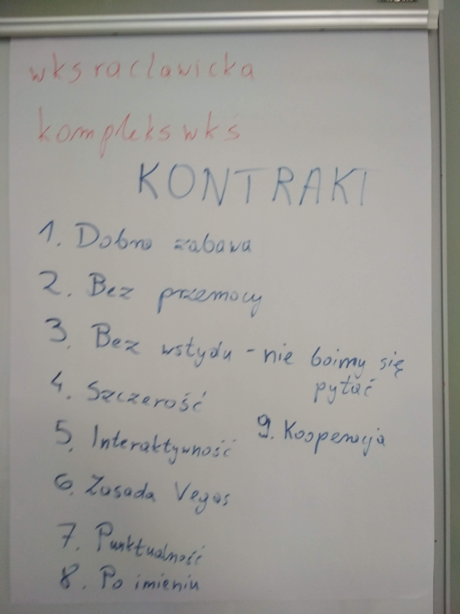
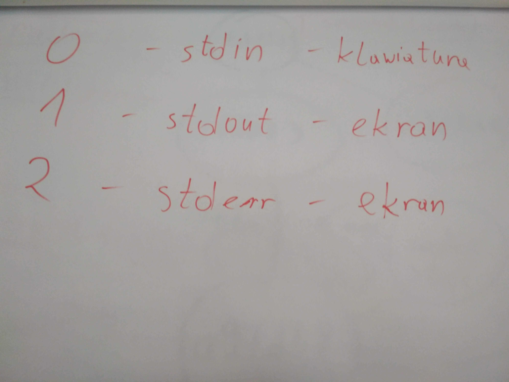
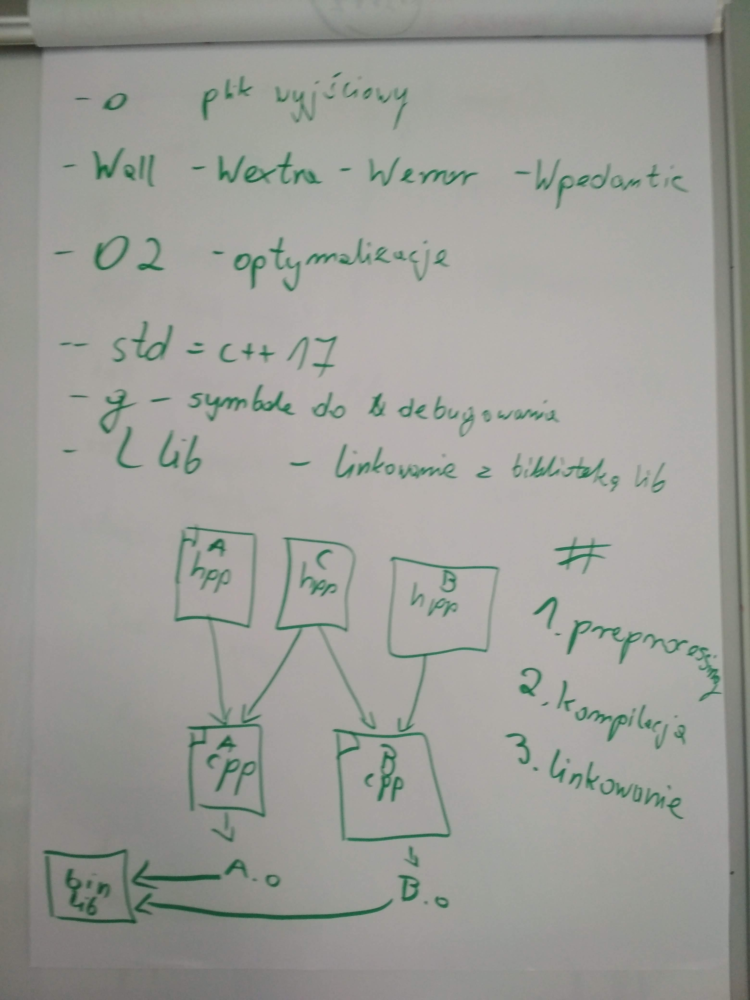

# Kurs-CPP

Materiały z kursu C++ (Lipiec 2019 - Wrzesień 2019)

## 06.07.2019 Narzędzia programisty (linux, vim, git, make, cmake, formatowanie kodu)

### Poprzedni pre-work

- [X] Instalacja Linuxa
- [X] Instalacja oprogramowania:
  - git
  - gitk lub gitg
  - make
  - cmake
  - vim
  - g++ lub clang++
  - gdb
  - valgrind
  - clang-format
  - clang-tidy lub clang-modernize
  - kdiff3 lub meld
  - qtCreator lub Visual Studio Code

### Materiały

- [Basic Linux commands](davechild_linux-command-line.pdf)
- [Vim Cheat Sheet](vim-cheat-sheet.gif)
- [Preferred Vim Configuration](https://github.com/amix/vimrc)
- [Git Cheat Sheet](github-git-cheat-sheet.pdf)
- [Historia terminala z zajęć](06.07.2019_history.txt)

### Nagrania i foto

- [06.07.2019 Wprowadzenie](https://www.youtube.com/watch?v=_3Kb8uEvn6s&list=PLQqoaQUqs4DCbDNiqBU3E9bFvX6YSUZc1&index=2&t=0s)
- [06.07.2019 Narzędzia programisty: linux i vim](https://www.youtube.com/watch?v=rltQ2aZQdqE&list=PLQqoaQUqs4DCbDNiqBU3E9bFvX6YSUZc1&index=3&t=0s)
- [06.07.2019 Narzędzia programisty: git](https://www.youtube.com/watch?v=_ElZZKoTnJY&list=PLQqoaQUqs4DCbDNiqBU3E9bFvX6YSUZc1&index=4&t=0s)
- [06.07.2019 Narzędzia programisty: kompilator, make, cmake](https://www.youtube.com/watch?v=j-P2MjCM40o&list=PLQqoaQUqs4DCbDNiqBU3E9bFvX6YSUZc1&index=5&t=0s)
- [06.07.2019 Narzędzia programisty: formatowanie kodu](https://www.youtube.com/watch?v=Y4OsUF9pfXk&list=PLQqoaQUqs4DCbDNiqBU3E9bFvX6YSUZc1&index=6&t=0s)
-  
   
  

### Post-work

- [ ] (1 punkt) Prześlij na Discordzie na kanale #narzedzia-programisty adres do swojego konta na GitHubie, tak aby wszyscy mogli Cię znaleźć i obserwować, czy robisz prace domowe ;D
- [ ] (1 punkty) Obczaj jak działa git revert i cofnij już skomitowane zmiany.
- [ ] (4 punkty) Przejdź samouczek vimtutor. Obowiązkowo pierwsze 4 rozdziały (1 rozdział - 1 punkt).
- [ ] (1 punkt) Czasem na GitHubie natkniesz się na projekty ze znaczkiem Build Passing (np. [Google Test](https://github.com/google/googletest)). Poczytaj czym jest CI (Continuous Integration) i jak jest ono oferowane na GitHubie (np. Travis CI, Circle CI). Przydatne linki:

  - [GitHub Continuous Integration](https://github.com/marketplace/category/continuous-integration)
  - [Continuous Delivery 101 (Part 1)](https://www.youtube.com/watch?v=HnWuIjUw_Q8)

- [ ] (1 punkt) Zarejestruj się w [serwisie Firecode.io](https://www.firecode.io), prześlij na Discordzie na kanale #firecode link do swojego profilu ([mój profil](https://www.firecode.io/pages/profile/21140)) i zacznij rozwiązywać zadania rekrutacyjne :) Jeśli będzie Ci mało zadań od nas to zawsze tam zaglądaj. 
- [ ] (1 punkt) Zapoznaj się pobieżnie ze [standardem kodowania Google](https://google.github.io/styleguide/cppguide.html) oraz [standardem kodowania LLVM](https://llvm.org/docs/CodingStandards.html). Możesz je porównać i wychwycić podobieństwa i różnice.
- [ ] (1 punkt) Zrób [test Narzędzia programisty](https://goo.gl/forms/EQurphnqBaOG20U32)
- [ ] (5 punktów) Spróbuj ustawić CI do programu Hello World z naszych zajęć. Spraw, aby GitHub sam budował cały projekt i mówił, czy czasem nie został scommitowany kod, który się nie kompiluje. Pokaż, że to działa spróbując komitować kod, który faktycznie się nie kompiluje, ale oczywiście potem wycofaj te zmiany za pomocą git revert. Możesz do tego użyć TravisCI albo CircleCI. Przydatne linki:

  - [Integrate Travis CI with your GitHub repo](https://github.com/mbonaci/mbo-storm/wiki/Integrate-Travis-CI-with-your-GitHub-repo)
  - [YouTube - How to start using Travis CI with your GitHub hosted code in 5 minutes](https://www.youtube.com/watch?v=FEXY1ZP-sBs)

### Pre-work

- [ ] Przeczytaj artykuł [Memory : Stack vs Heap](https://www.gribblelab.org/CBootCamp/7_Memory_Stack_vs_Heap.html)
- [ ] Przygotuj swoją funkcję sprawdzającą, czy podany ciąg znaków jest palindromem
