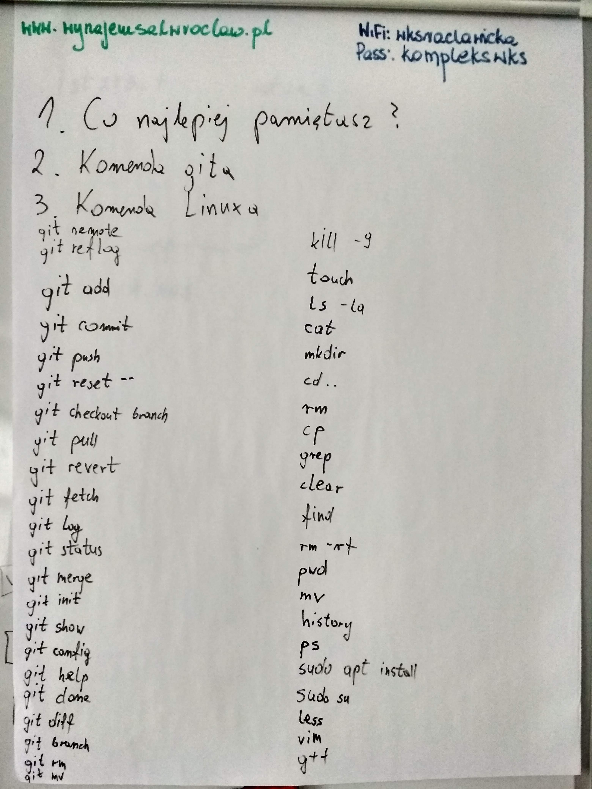
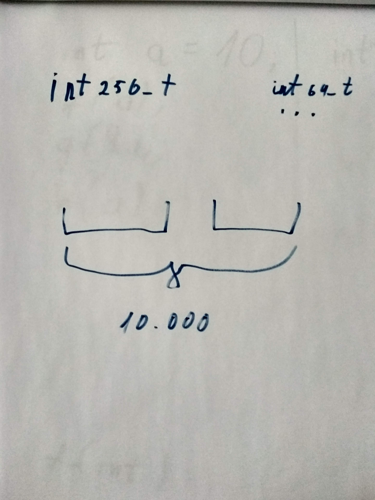
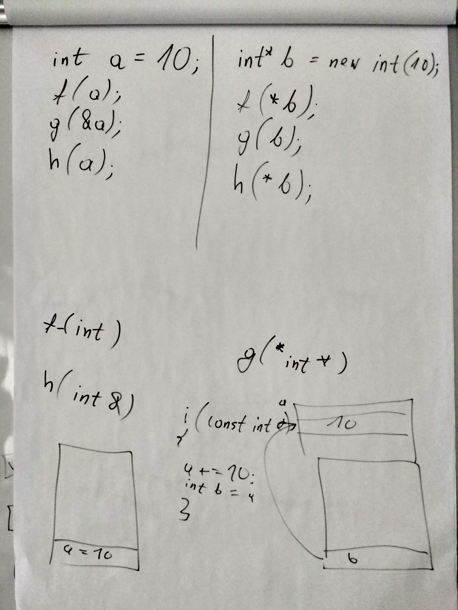
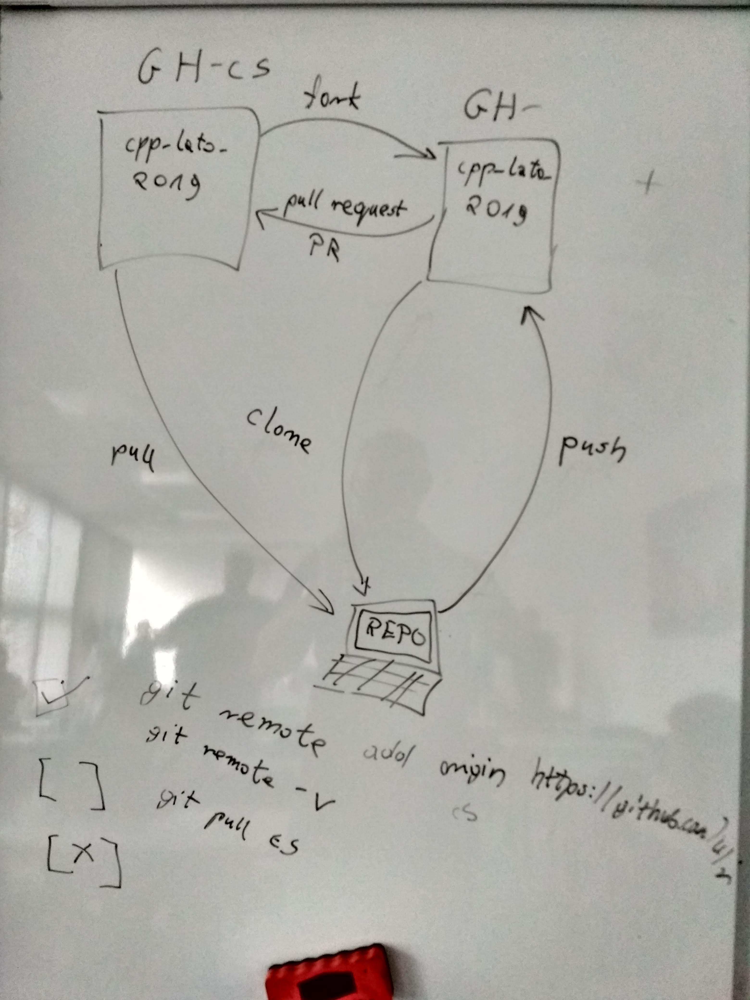

# Kurs-CPP

Materiały z kursu C++ (Lipiec 2019 - Wrzesień 2019)

## 13.07.2019 Podstawy C++ (podstawowe typy, funkcje, rekurencja, stos, sterta, wskaźniki, referencje, OOP, klasy, konstruktory, destruktory, operatory)

### Poprzedni Pre-work

- [x] Przeczytaj artykuł [Memory : Stack vs Heap](https://www.gribblelab.org/CBootCamp/7_Memory_Stack_vs_Heap.html)
- [x] Przygotuj swoją funkcję sprawdzającą, czy podany ciąg znaków jest palindromem

### Materiały

- [Prezentacja C++ Introduction](cpp_introduction.pdf)
- [C++ Fundamental types](https://en.cppreference.com/w/cpp/language/types)
- [C++ Fixed width integer types](https://en.cppreference.com/w/cpp/types/integer)
- [More about recursion](https://www.geeksforgeeks.org/recursion/)
- [Memory : Stack vs Heap](https://www.gribblelab.org/CBootCamp/7_Memory_Stack_vs_Heap.html)
- [Pointers vs References in C++](https://www.geeksforgeeks.org/pointers-vs-references-cpp/)
- [C++ keywords](https://en.cppreference.com/w/cpp/keyword)
- [C++ Classes and Objects](https://www.geeksforgeeks.org/c-classes-and-objects)

### Nagrania i foto

- [13.07.2019 Podstawy C++: wstęp](https://www.youtube.com/watch?v=y0OF_lkWmqM&list=PLQqoaQUqs4DCbDNiqBU3E9bFvX6YSUZc1&index=7)
- [13.07.2019 Podstawy C++: typy](https://www.youtube.com/watch?v=7AsPSKEbgXI&list=PLQqoaQUqs4DCbDNiqBU3E9bFvX6YSUZc1&index=7)
- [13.07.2019 Podstawy C++: rekurencja](https://www.youtube.com/watch?v=XyXVNRgHl48&list=PLQqoaQUqs4DCbDNiqBU3E9bFvX6YSUZc1&index=8)
- [13.07.2019 Podstawy C++: stos i sterta](https://www.youtube.com/watch?v=WBypsZQTFQw&list=PLQqoaQUqs4DCbDNiqBU3E9bFvX6YSUZc1&index=10)
- [13.07.2019 Podstawy C++: słowa kluczowe](https://www.youtube.com/watch?v=YBrUiI-wr0k&list=PLQqoaQUqs4DCbDNiqBU3E9bFvX6YSUZc1&index=11)
- [13.07.2019 Podstawy C++: programowanie obiektowe](https://www.youtube.com/watch?v=3Sm1YJfch2g&list=PLQqoaQUqs4DCbDNiqBU3E9bFvX6YSUZc1&index=12)
- [13.07.2019 Podstawy C++: kopie, referencje, wskaźniki](https://www.youtube.com/watch?v=IAI08UqGjL0&list=PLQqoaQUqs4DCbDNiqBU3E9bFvX6YSUZc1&index=13)
- [13.07.2019 Podstawy C++: zdalne repozytoria](https://www.youtube.com/watch?v=2XUidG2NIpo&list=PLQqoaQUqs4DCbDNiqBU3E9bFvX6YSUZc1&index=14)
-  
   

### Post-work

- [x] (2 punkty) Spróbuj zamienić std::size_t na float w funkcji [palindrom](palindrom.cpp). Wynik zapisz jako komentarz wewnątrz pliku.
- [x] (2 punkty) Zrób optymalizację, żeby pozbyć się kopiowania stringów w  [rekurencyjnej funkcji palindrom](palindrom_recursive.cpp). 

Podpowiedź

Zapoznaj się z std::string_view

- [ ] (1 punkt) Zapoznaj się ze wszystkimi slowami kluczowymi z rozdziału "Basic" z prezentacji (43 slajd).
- [ ] (3 punkty) Funkcja [toString](long_int.cpp) posiada bug. Spróbuj go znaleźć i naprawić. 

Podpowiedź

Spróbuj dostać takie wartości "0", "10", "3001"

- [ ] (2 punkty) Zapoznaj się ze słowem kluczowym "default" i użyj go w [tym kodzie](long_int.cpp)
- [ ] (3 punktow) Dopisz brakujące operatory takie jak "-=", "-", "+" w [tym kodzie](long_int.cpp)
- [ ] (2 punktow) Dopisz własne operatory "<<" oraz ">>" żeby twoją klasę można było użyć razem z std::cout i std::cin w [tym kodzie](long_int.cpp)

Podpowiedź

Zobacz ten [przykład](https://medium.com/@nonuruzun/overloading-input-output-operators-in-c-a2a74c5dda8a)

### Jak zaraportować wykonanie pracy domowej?

1. (Jednorazowo) Kliknij na przycisk Fork w prawy górnym rogu GitHuba. Spowoduje to utworzenie kopii tego repozytorium na Twoim koncie GitHub.
2. (Jednorazowo) Ściągnij swoje sforkowane repozytorium (`git clone https://github.com/USERNAME/kurs_cpp_lato_2019.git`)
3. Zmodyfikuj odpowiednie pliki, aby zawierały Twoje rozwiązanie. Rób commity np. 1 na każde zadanie. Zaznaczaj też na bieżąco checkboxy powyżej przy już zrealizowanych zadaniach.
4. Przyznaj sobie odpowiednią liczbę punktów w tabeli głównej.
5. Zanim wyślesz zmiany na swoje konto na GitHubie upewnij się, że posiadasz najnowszą wersję głównego repozytorium (`git pull https://github.com/coders-school/kurs_cpp_lato_2019.git`)
6. Wyślij swoje zmiany na swoje konto GH (`git push origin master`)
7. Utwórz Pull Request poprzez GitHuba.
8. Jeśli w międzyczasie coś dodasz lub zmienisz to po wykonaniu `git push origin master` Pull Request zostanie automatycznie zaktualizowany, nie musisz tworzyć go ponownie.
9. W przyszłości przed każdorazową zmianą czegokolwiek zawsze zaciągnij najpierw zmiany z głównego repozytorium z konta coders-school (`git pull https://github.com/coders-school/kurs_cpp_lato_2019.git`). Może to oszczędzić wielu problemów :)

### Pre-work

- [ ] Zapoznaj się ze [ściągą o polimorfiźmie](https://github.com/coders-school/kurs_cpp_zima_2019/blob/master/L06-algorithms%2Ctesting/polimorfizm.pdf)