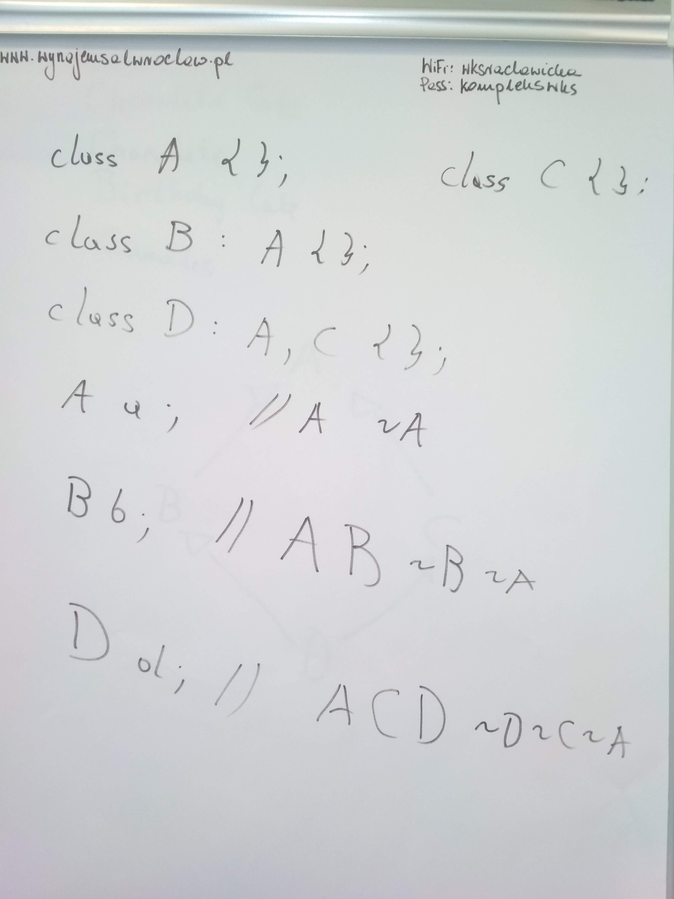
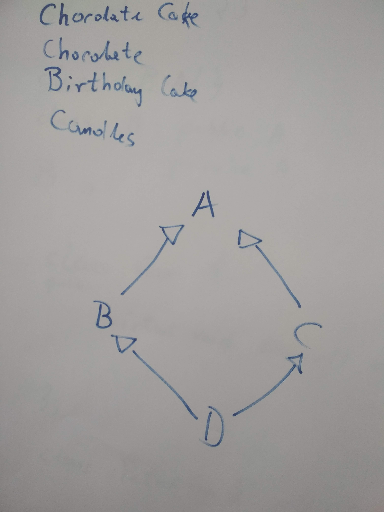
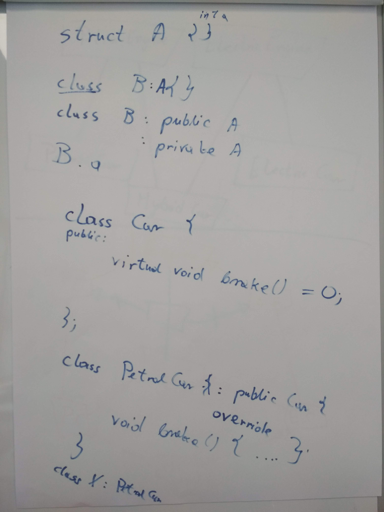
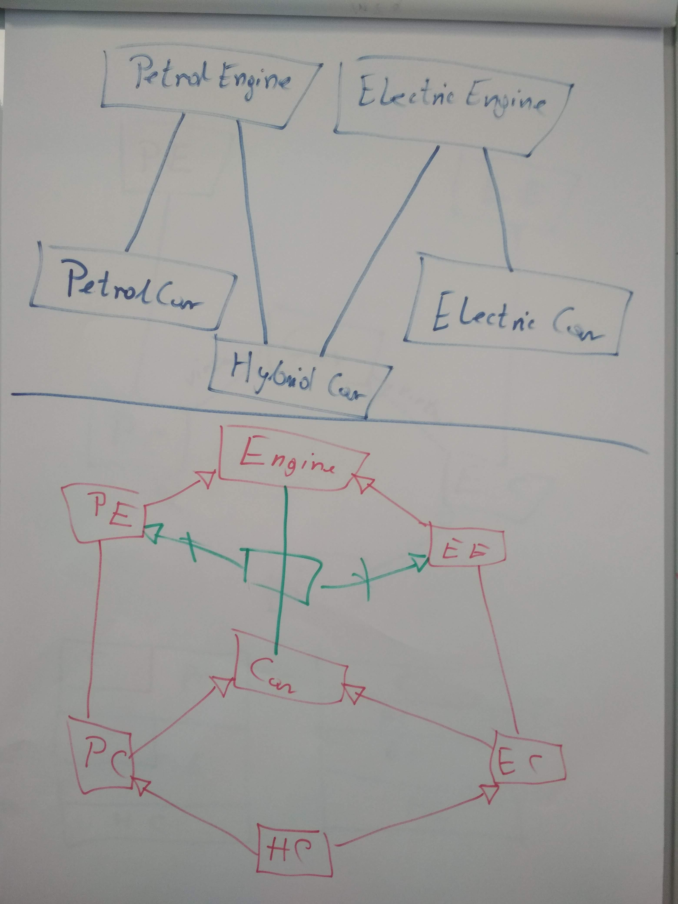
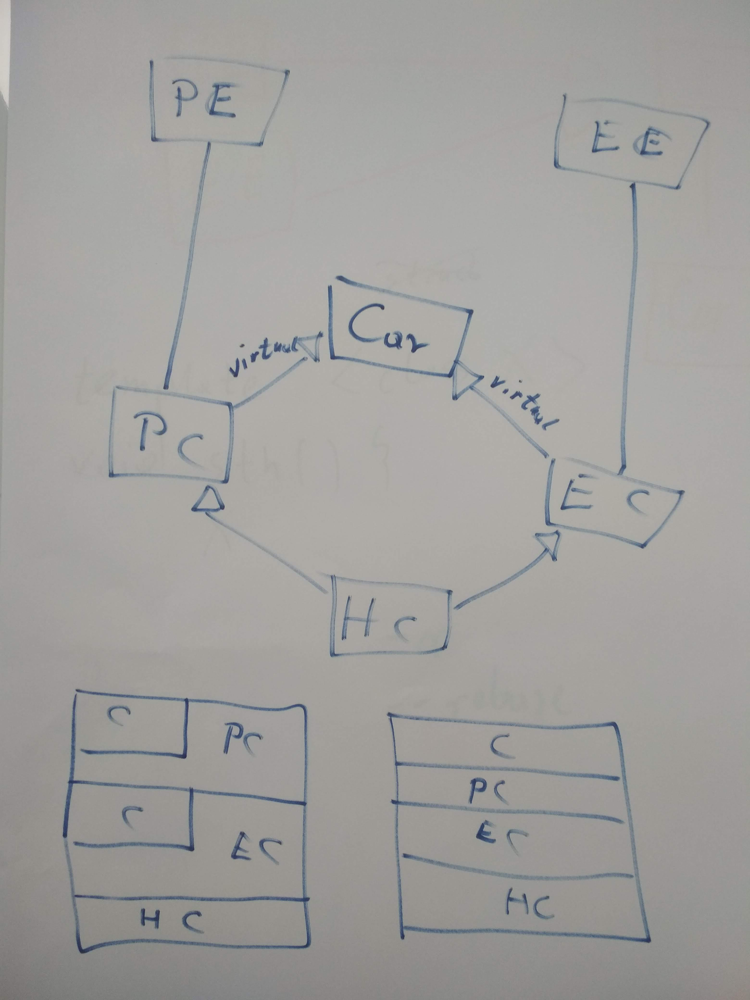
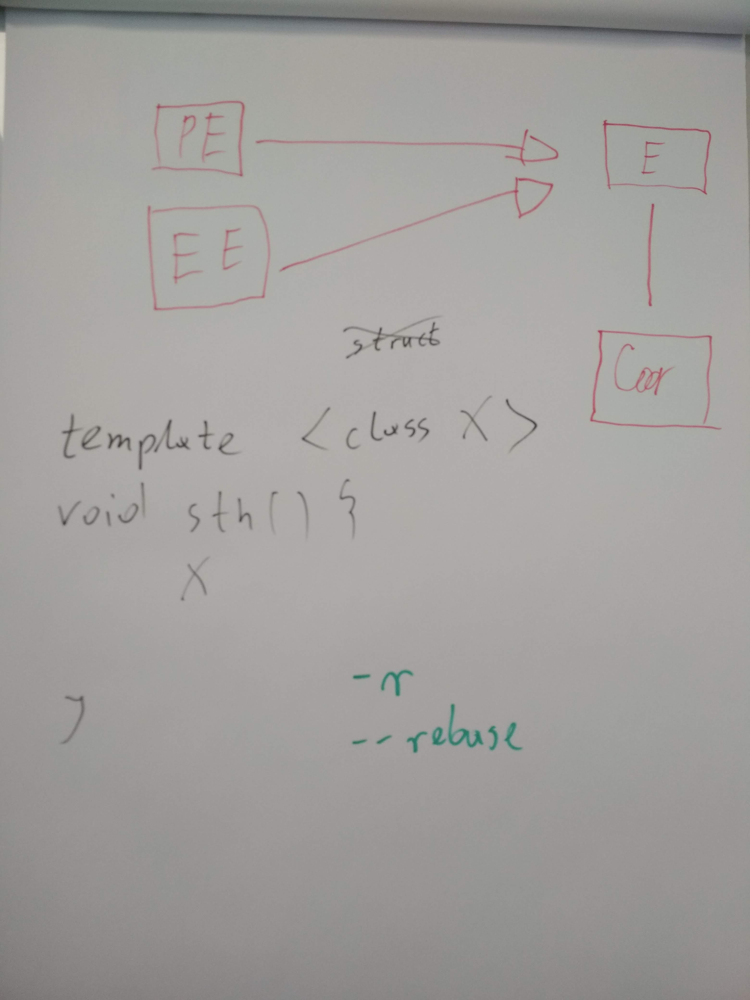

# Kurs-CPP

Materiały z kursu C++ (Lipiec 2019 - Wrzesień 2019)

## 20.07.2019 Obiektowy C++ (abstrakcja, enkapsulacja, dziedziczenie, polimorfizm, problem diamentowy)

### Poprzedni Pre-work

- [x] Zapoznaj się ze [ściągą o polimorfiźmie](https://github.com/coders-school/kurs_cpp_zima_2019/blob/master/L06-algorithms%2Ctesting/polimorfizm.pdf)

### Materiały

- [Prezentacja Obiektowy C++](object_oriented_cpp.pdf)
- [Pre-test](pre-test.txt)
- [Post-test](post-test.txt)
- [Repozytorium z wstępnym projektem](https://github.com/coders-school/Cars)
- [Branch z naszym rozwiązaniem z zajęć](https://github.com/coders-school/Cars/tree/2019_lato)
- [Kolejność inicjalizacji](https://dorwijnerda.pl/blog/kolejnosc-inicjalizacji/)

### Nagrania i foto

- [20.07.2019 Obiektowy C++: wstęp](https://www.youtube.com/watch?v=zLRcmbIah04&list=PLQqoaQUqs4DCbDNiqBU3E9bFvX6YSUZc1&index=14)
- [20.07.2019 Obiektowy C++: 4 filary obiektowość](https://www.youtube.com/watch?v=6Kv8bBvf9Es&list=PLQqoaQUqs4DCbDNiqBU3E9bFvX6YSUZc1&index=15)
- [20.07.2019 Obiektowy C++: projekt Cars](https://www.youtube.com/watch?v=RDUvty4-TEA&list=PLQqoaQUqs4DCbDNiqBU3E9bFvX6YSUZc1&index=16)
- [20.07.2019 Obiektowy C++: abstrakcja](https://www.youtube.com/watch?v=5HeeEuSdrws&list=PLQqoaQUqs4DCbDNiqBU3E9bFvX6YSUZc1&index=17)
- [20.07.2019 Obiektowy C++: enkapsulacja](https://www.youtube.com/watch?v=RgF4bMei1IY&list=PLQqoaQUqs4DCbDNiqBU3E9bFvX6YSUZc1&index=18)
- [20.07.2019 Obiektowy C++: dziedziczenie](https://www.youtube.com/watch?v=rY3rs7R0--Q&list=PLQqoaQUqs4DCbDNiqBU3E9bFvX6YSUZc1&index=19)
- [20.07.2019 Obiektowy C++: polimorfizm](https://www.youtube.com/watch?v=WAkWuns1rCI&list=PLQqoaQUqs4DCbDNiqBU3E9bFvX6YSUZc1&index=20)
- [20.07.2019 Obiektowy C++: abstrakcja w projekcie Cars](https://www.youtube.com/watch?v=JqsiN_E4Rzg&list=PLQqoaQUqs4DCbDNiqBU3E9bFvX6YSUZc1&index=21)
- [20.07.2019 Obiektowy C++: implementacja w projekcie Cars](https://www.youtube.com/watch?v=sXMjOSCMKCU&list=PLQqoaQUqs4DCbDNiqBU3E9bFvX6YSUZc1&index=22)
- [20.07.2019 Obiektowy C++: praca domowa](https://www.youtube.com/watch?v=5f3CxyVnMM4&list=PLQqoaQUqs4DCbDNiqBU3E9bFvX6YSUZc1&index=23)
-  
   
   

### Post-work

Pracujcie w parach lub po 3 osoby na wspólnym repo. Punkty zostaną przyznane wszystkim osobom w grupie, których commity będą widoczne w PR.

- [ ] (2 punkty) Naprawcie enkapsulację, aby m.in. nie można było wymienić silnika podczas jazdy samochodem
- [ ] (2 punkty) Naprawcie wycieki pamięci poprzez zwalnianie zaalokowanych obiektów (silników) w odpowiednich destruktorach
- [ ] (2 punkt) Dodajcie do samochodów pole `velocity`, które będzie przechowywać aktualną prędkość pojazdu i modyfikujcie je odpowienio w funkcjach `accelerate()` oraz `brake()`
- [ ] (3 punkty) Poprawcie interfejs, aby był jak najmniej podatny na niewłaściwe użycie (np. accelerate(-999))
- [ ] (4 punktów) Napiszcie w dowolny sposób kilka testów do obecnej funkcjonalności, m.in. sprawdzających pole `velocity`. Nie musicie używać żadnego frameworka, jeśli nie znacie. Wystarczy funkcja `assert()`.
- [ ] (2 punkty) Utwórzcie wyjątek InvalidGear, który powinien być rzucony w momencie, gdy ktoś próbuje np. zmienić bieg z 5 na R. Powinien on dziedziczyć z jednego z wyjątków z biblioteki standardowej

### Pre-work

- [ ] Zapoznaj się z [opisem kontenerów](http://en.cppreference.com/w/cpp/container)
- [ ] [Playlista na YT odnosnie STLa](https://www.youtube.com/playlist?list=PL5jc9xFGsL8G3y3ywuFSvOuNm3GjBwdkb) - obejrzyj ile mozesz :)
- [ ] Przeczytaj [artykuł Marcina Pietraszka o złożoności obliczeniowej](http://www.samouczekprogramisty.pl/podstawy-zlozonosci-obliczeniowej/)

### Uwagi

1. Gettery powinny być constowe, bo nie zmieniają one żadnego pola klasy.

    ```cpp
    int getValue() const;
    ```
