# Kurs-CPP

Materiały z kursu C++ (Lipiec 2019 - Wrzesień 2019)

## Grupa weekendowa

### 10.08.2019 Testowanie #1 (struktura projektu, Catch2, GTest, TDD)

### 11.08.2019 Testowanie #2 (gdb, Coding Dojo, GMock, Dependency Injection)

## Grupa wieczorowa

### 12.08.2019 Testowanie #1 (struktura projektu, Catch2, GTest, TDD)

### 13.08.2019 Testowanie #2 (gdb, Coding Dojo, GMock, Dependency Injection)

### Poprzedni Pre-work

- [x] Obejrzyj [wideo Uncle Boba o TDD](https://trello-attachments.s3.amazonaws.com/5b20ebcd819b419f2d65c274/5b5d70bf109bc670f6d8d10d/90fb5c9305b6e8092df116da1c845210/fm_CleanCode-E6-P2-540p.mp4). Do zrozumienia punktacji gry w kręgle przydatny może być [ten opis zasad](bowling.txt)
- [x] Poczytaj dokumentację frameworka do testowania [Catch2](https://github.com/catchorg/Catch2/blob/master/docs/tutorial.md)
- [x] Poczytaj dokumentację frameworka do testowania [GTest](https://github.com/google/googletest/blob/master/googletest/docs/primer.md)
- [x] Obejrzyj [strukturę projektu oraz CMake do testów w GTest](https://github.com/coders-school/CourseDashboard)
- [x] **Używając frameworka Catch2 napisz kilka testów do pierwszego US w projekcie**

### Materiały

- [Dokumentacja frameworka do testowania Catch2](https://github.com/catchorg/Catch2/blob/master/docs/tutorial.md)
- [Dokumentację frameworka do testowania GTest](https://github.com/google/googletest/blob/master/googletest/docs/primer.md)
- [Repo parentheses](https://github.com/coders-school/parentheses)
- [Repozytorium Pizzas](https://github.com/ziobron/Pizzas)

### Nagrania i foto

#### Grupa weekendowa

- 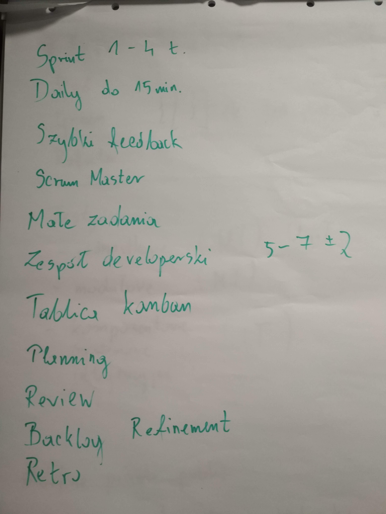 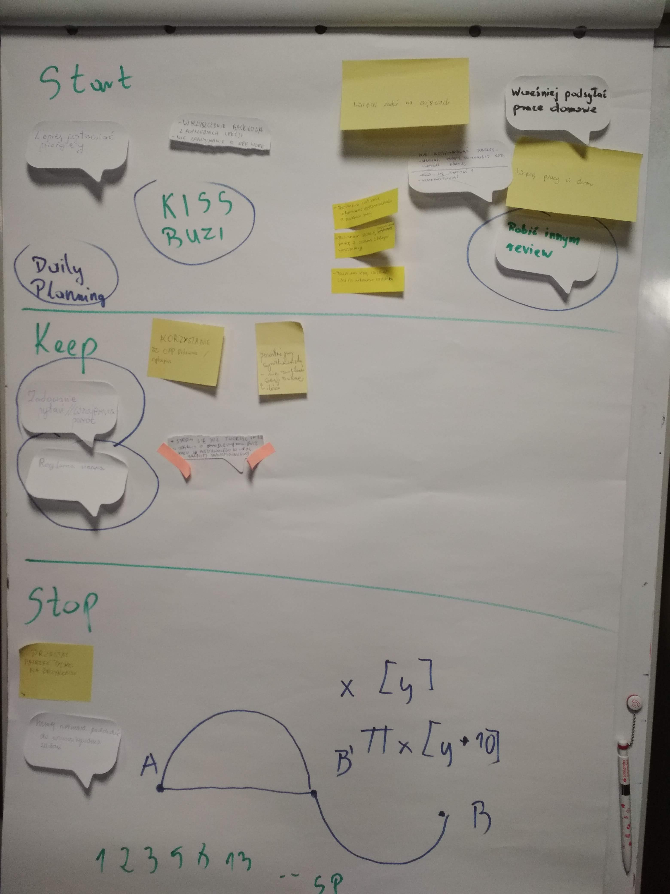
  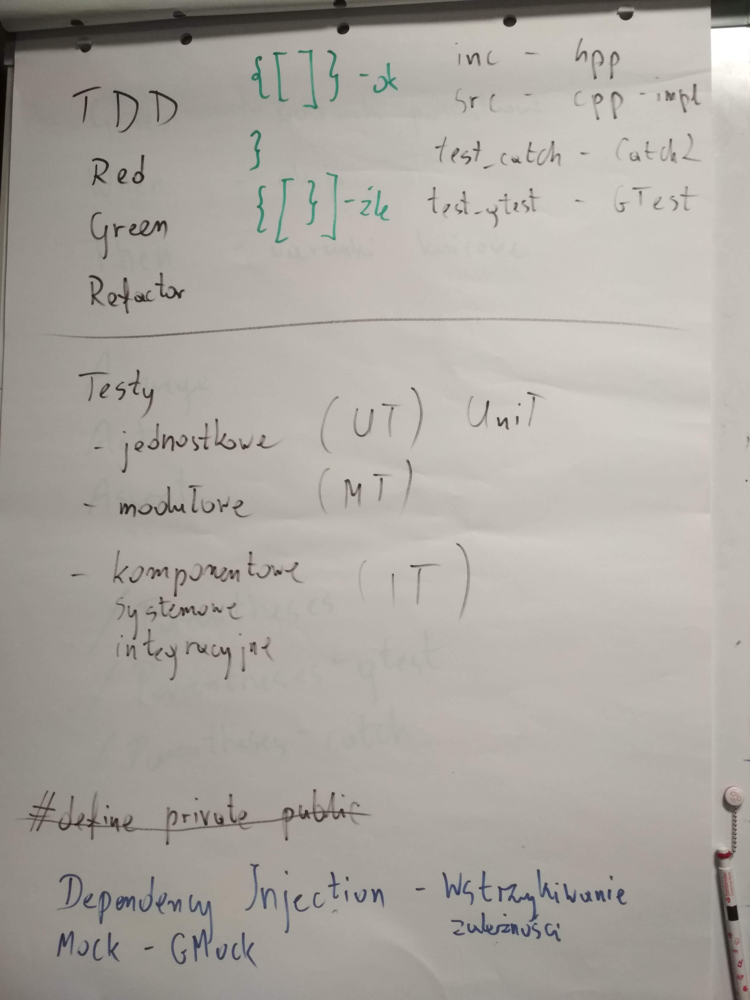 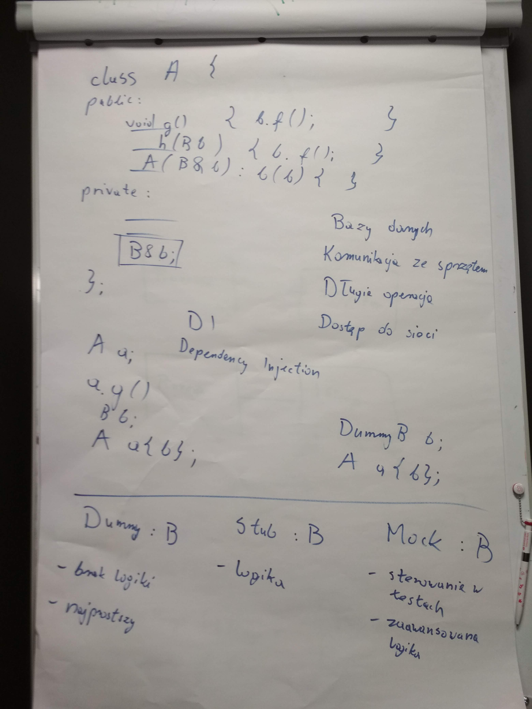
  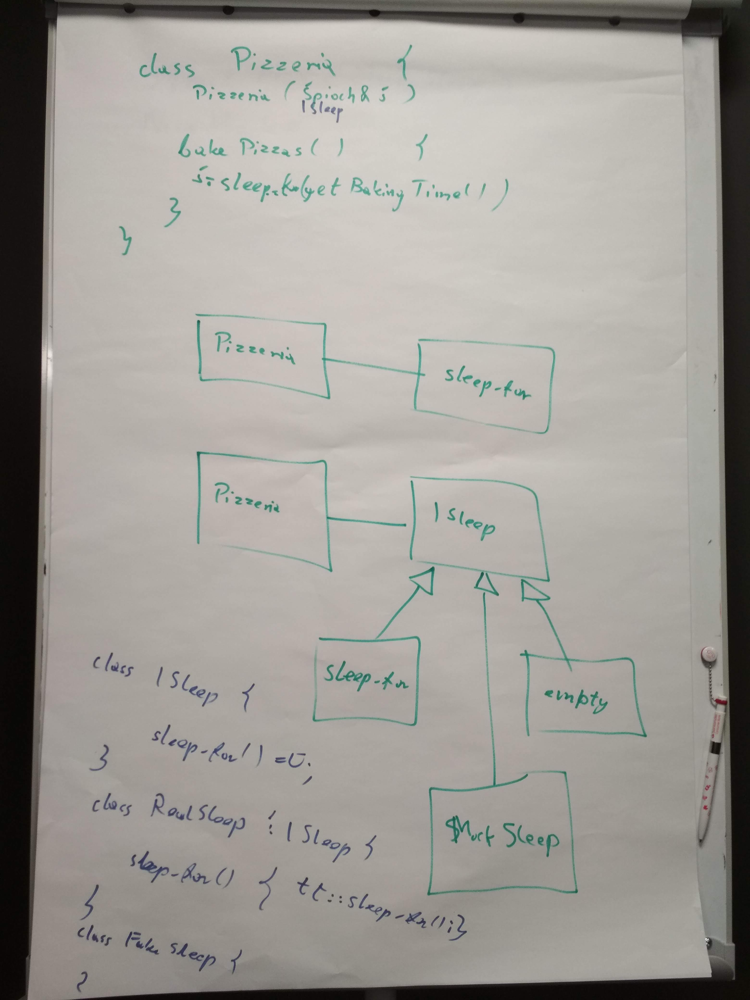 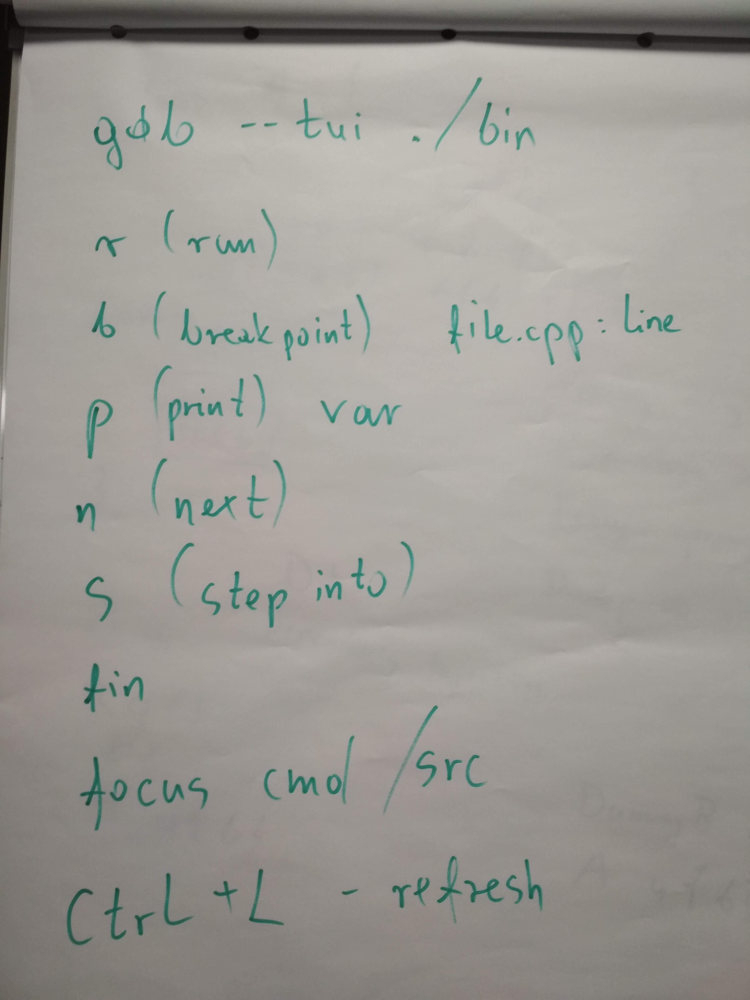
  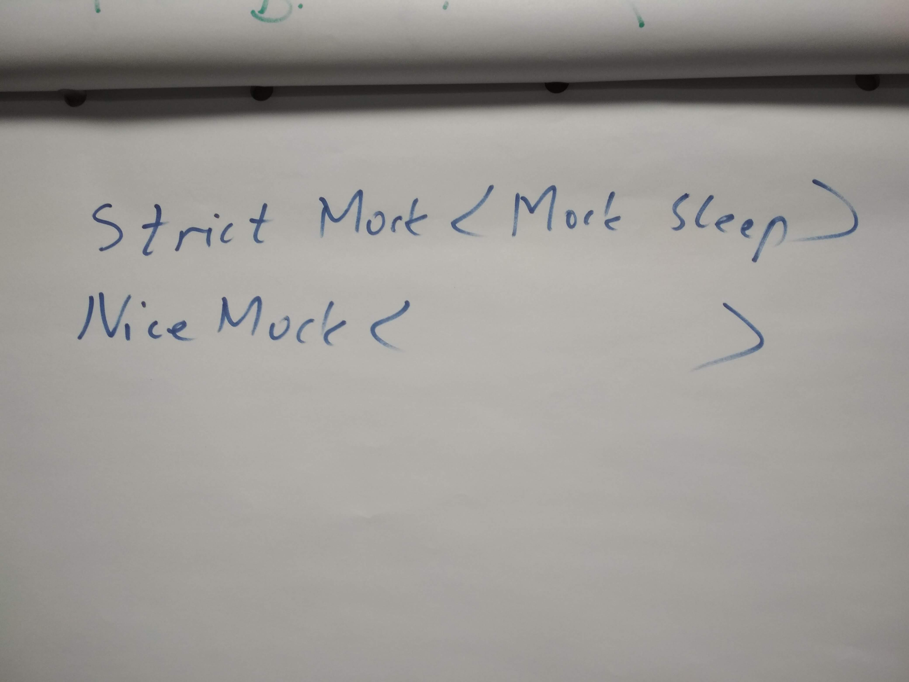 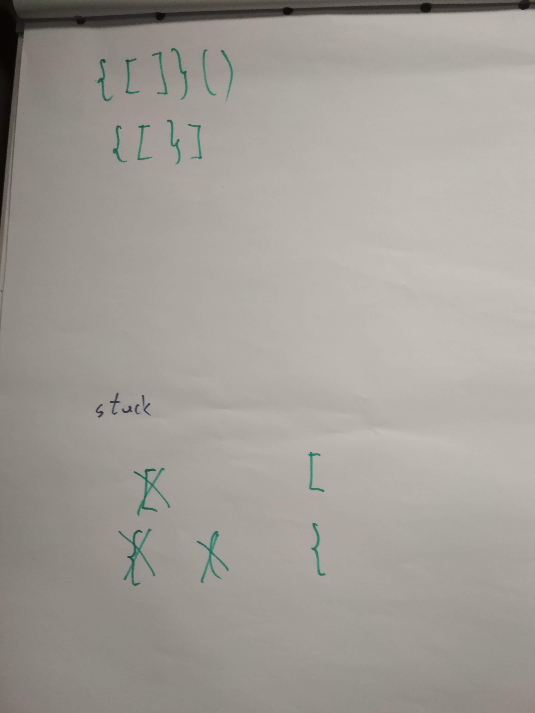
- [10.08.2019 Testowanie#1: Retro](https://www.youtube.com/watch?v=PDNj3-b88gM&list=PLQqoaQUqs4DCoZOgDbqR-KfGSxParz1Pf&index=18)
- [10.08.2019 Testowanie#1: TDD](https://www.youtube.com/watch?v=kKSwquJMjZw&list=PLQqoaQUqs4DCoZOgDbqR-KfGSxParz1Pf&index=19)
- [10.08.2019 Testowanie#1: zadanie Parentheses i praca domowa](https://www.youtube.com/watch?v=u5PjbPT4AyY&list=PLQqoaQUqs4DCoZOgDbqR-KfGSxParz1Pf&index=20)
- [11.08.2019 Testowanie#2: Coding Dojo - gdb bug fixing](https://www.youtube.com/watch?v=emskYVH2wFA&list=PLQqoaQUqs4DCoZOgDbqR-KfGSxParz1Pf&index=21)
- [11.08.2019 Testowanie#2: dependency injection, dummy, stub, mock](https://www.youtube.com/watch?v=H72j_XIZEfI&list=PLQqoaQUqs4DCoZOgDbqR-KfGSxParz1Pf&index=22)
- [11.08.2019 Testowanie#2: Coding Dojo: dependency injection](https://www.youtube.com/watch?v=rbqRVc7EbYM&list=PLQqoaQUqs4DCoZOgDbqR-KfGSxParz1Pf&index=23)
- [11.08.2019 Testowanie#2: Coding Dojo: mockowanie](https://www.youtube.com/watch?v=bMir93BUAXM&list=PLQqoaQUqs4DCoZOgDbqR-KfGSxParz1Pf&index=24)
  
#### Grupa wieczorowa

- 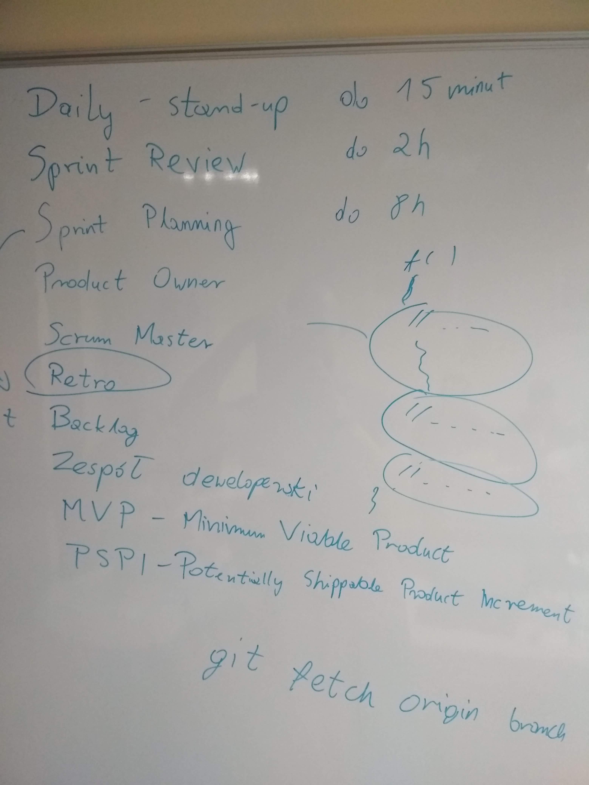 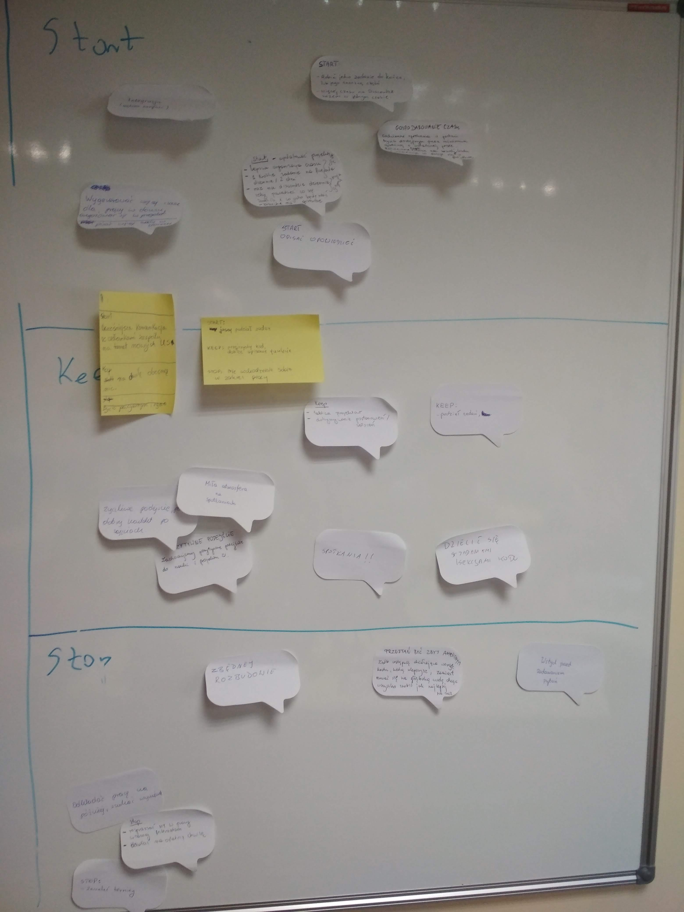
  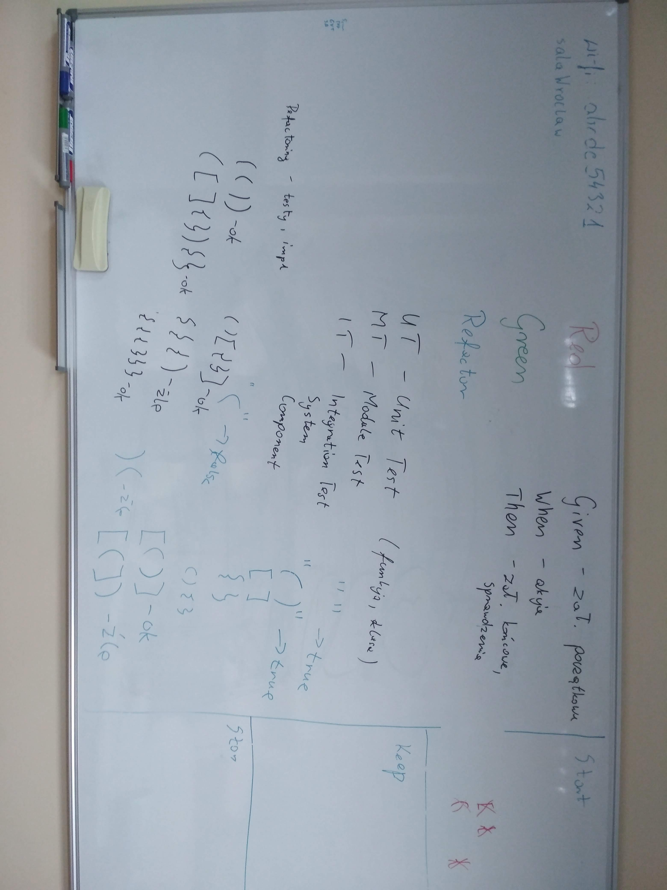 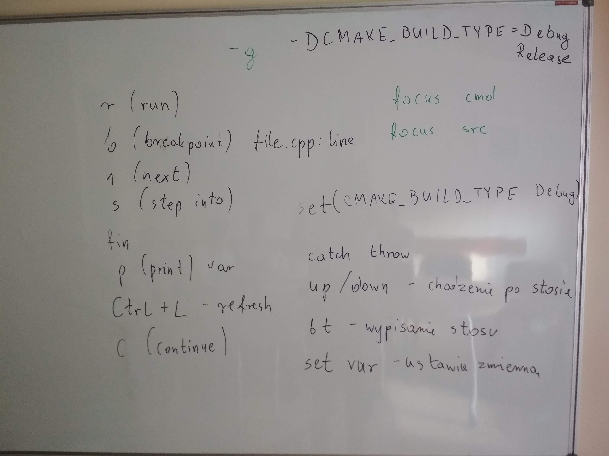
  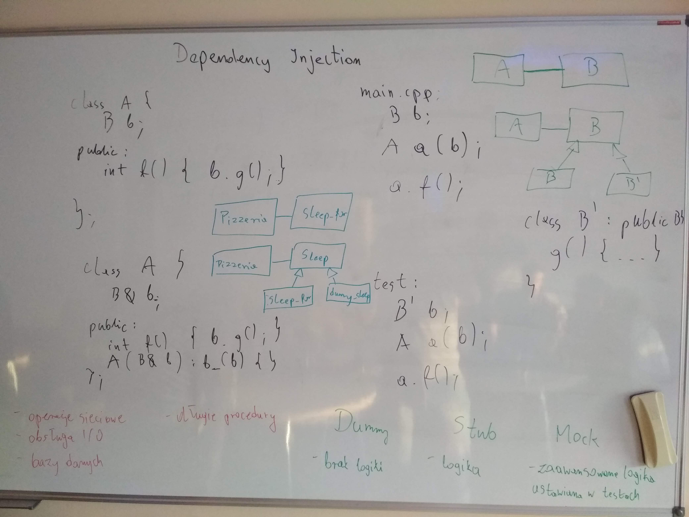 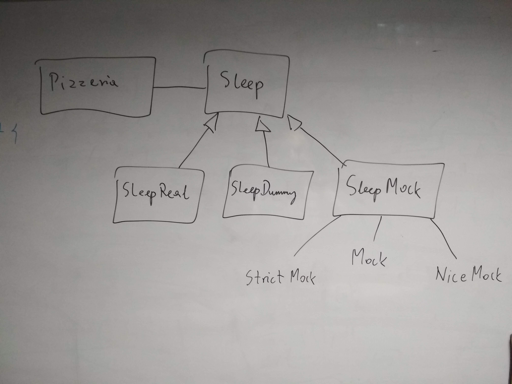
- [12.08.2019 Testowanie#1: Powtórka ze Scruma](https://www.youtube.com/watch?v=znJNKRruLIQ&list=PLQqoaQUqs4DCaFPwa3qfVlJc9YOfZkPAO&index=14)
- [12.08.2019 Testowanie#1: Retro](https://www.youtube.com/watch?v=Q4in4k_kCvY&list=PLQqoaQUqs4DCaFPwa3qfVlJc9YOfZkPAO&index=15)
- [12.08.2019 Testowanie#1: TDD, UT](https://www.youtube.com/watch?v=30laAhhhxNE&list=PLQqoaQUqs4DCaFPwa3qfVlJc9YOfZkPAO&index=16)
- [12.08.2019 Testowanie#1: zadanie Parentheses i praca domowa](https://www.youtube.com/watch?v=zQOURios_DU&list=PLQqoaQUqs4DCaFPwa3qfVlJc9YOfZkPAO&index=17)
- [13.08.2019 Testowanie#2: Coding Dojo - gdb i bugfixing](https://www.youtube.com/watch?v=lv5rMGs347Q&list=PLQqoaQUqs4DCaFPwa3qfVlJc9YOfZkPAO&index=18)
- [13.08.2019 Testowanie#2: Dependency Injection](https://www.youtube.com/watch?v=dvIXN70wRBY&list=PLQqoaQUqs4DCaFPwa3qfVlJc9YOfZkPAO&index=19)
- [13.08.2019 Testowanie#2: Coding Dojo - Dependency Injection](https://www.youtube.com/watch?v=-wC4pU9yO8Y&list=PLQqoaQUqs4DCaFPwa3qfVlJc9YOfZkPAO&index=20)
- [13.08.2019 Testowanie#2: Coding Dojo - mockowanie](https://www.youtube.com/watch?v=F76ILFCAgTA&list=PLQqoaQUqs4DCaFPwa3qfVlJc9YOfZkPAO&index=21)

### Post-work

W tych samych grupach co na zajęciach wykonajcie poniższe zadania:

- [ ] (6 punktów) dokończenie testów dla Parentheses w Catch2
- [ ] (6 punktów) napisanie analogicznych testów dla Parentheses w GTest
- [ ] (6 punktów) ładna zrefaktoryzowana, prosta implementacja
- [x] (6 punktów) dokończenie [Pizzas](https://github.com/ziobron/Pizzas)

### Pre-work

- [ ] poszukaj informacji o tym czym jest program `valgrind` i jak go używać do znajdywania wycieków pamięci
- [ ] poczytaj w dowolnym źródle o smart pointerach (unique_ptr, shared_ptr, weak_ptr)
