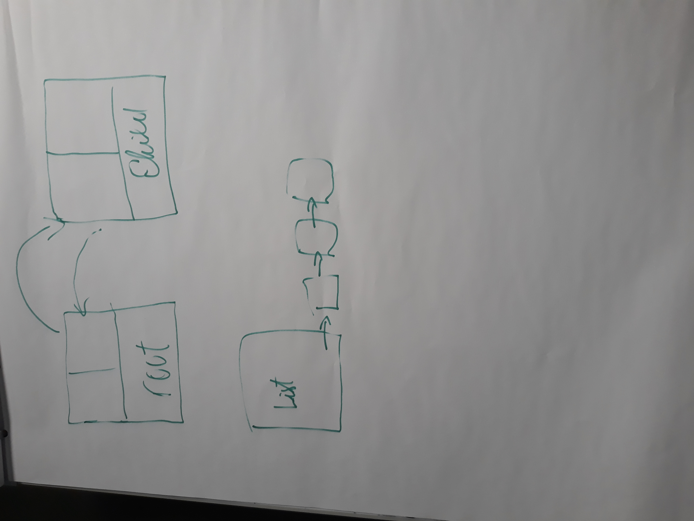
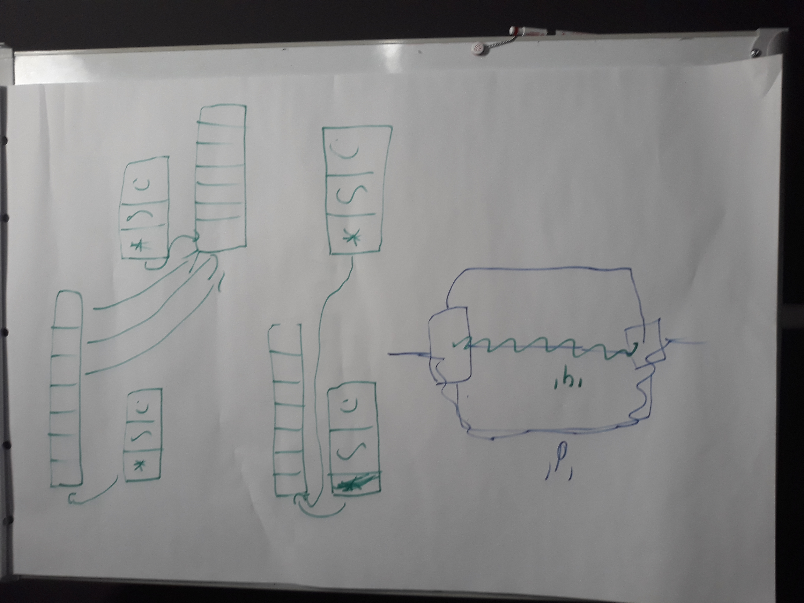
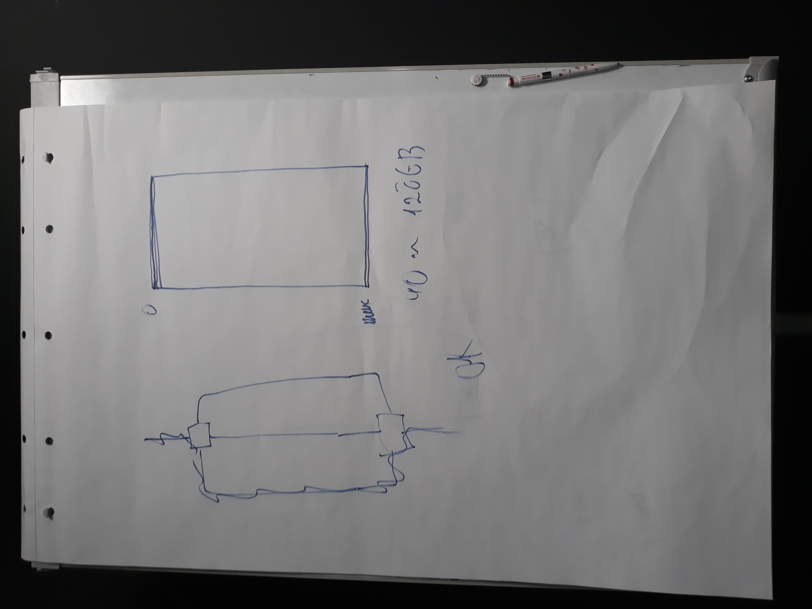
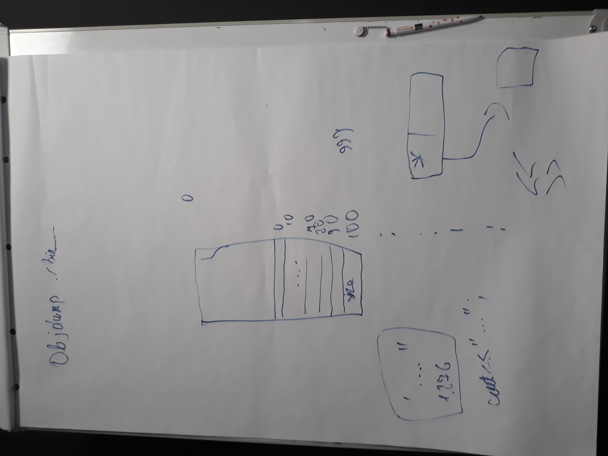
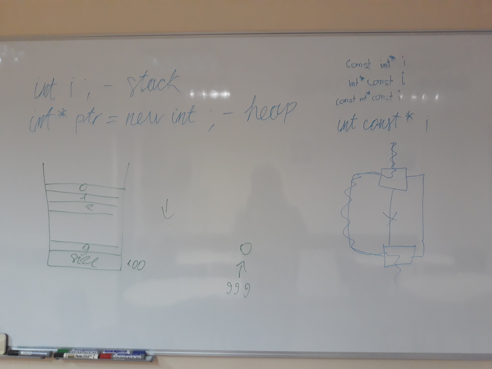

# Kurs-CPP

Materiały z kursu C++ (Lipiec 2019 - Wrzesień 2019)

## Grupa weekendowa

### 17.08.2019 Zarządzanie pamięcią #1 (problemy z pamięcią, valgrind)

### 18.08.2019 Zarządzanie pamięcią #2 (smart pointery, zadania)

## Grupa wieczorowa

### 19.08.2019 Zarządzanie pamięcią #1 (problemy z pamięcią, valgrind)

### 20.08.2019 Zarządzanie pamięcią #2 (smart poinery, zadania)

### Poprzedni Pre-work

- [x] poszukaj informacji o tym czym jest program `valgrind` i jak go używać do znajdywania wycieków pamięci
- [x] poczytaj w dowolnym źródle o smart pointerach (unique_ptr, shared_ptr, weak_ptr)

### Materiały

- [Prezentacja o problemach z pamięcią](memory_management_problems.pdf)
- [Prezentacja o smart pointerach](smart_pointers.pdf)
- [Repo memory_management](https://github.com/coders-school/memory_management)
- [Semantyka przenoszenia](https://infotraining.bitbucket.io/cpp-11/move.html)
- [Pre-test](pre-test.txt)
- [Post-test](post-test.txt)

### Nagrania i foto

#### Grupa weekendowa

-  
   
- [17.08.2019 Zarządzanie pamięcią#1: pretest](https://www.youtube.com/watch?v=-Qh98D1aAZo&list=PLQqoaQUqs4DCoZOgDbqR-KfGSxParz1Pf&index=25)
- [17.08.2019 Zarządzanie pamięcią#1: Organizacja pamięci, informacje o pamięci](https://www.youtube.com/watch?v=vPz_sYy_d3o&list=PLQqoaQUqs4DCoZOgDbqR-KfGSxParz1Pf&index=26)
- [17.08.2019 Zarządzanie pamięcią#1: problemy z pamięcią](https://www.youtube.com/watch?v=ACQV9O7bb5g&list=PLQqoaQUqs4DCoZOgDbqR-KfGSxParz1Pf&index=27)
- [17.08.2019 Zarządzanie pamięcią#1: wyjątki i RAII](https://www.youtube.com/watch?v=L46Hixb8u4Y&list=PLQqoaQUqs4DCoZOgDbqR-KfGSxParz1Pf&index=28)
- [18.08.2019 Zarządzanie pamięcią#2: unique_ptr](https://www.youtube.com/watch?v=ctVXSZzJWtE&list=PLQqoaQUqs4DCoZOgDbqR-KfGSxParz1Pf&index=29)
- [18.08.2019 Zarządzanie pamięcią#2: shared_ptr i weak_ptr](https://www.youtube.com/watch?v=Uwqi6FRTPu8&list=PLQqoaQUqs4DCoZOgDbqR-KfGSxParz1Pf&index=30)
- [18.08.2019 Zarządzanie pamięcią#2: najlepsze praktyki](https://www.youtube.com/watch?v=JqtyawGlSHA&list=PLQqoaQUqs4DCoZOgDbqR-KfGSxParz1Pf&index=31)
- [18.08.2019 Zarządzanie pamięcią#2: szczegóły implementacyjne smart pointerów](https://www.youtube.com/watch?v=qXJbhFviurM&list=PLQqoaQUqs4DCoZOgDbqR-KfGSxParz1Pf&index=32)
- [18.08.2019 Zarządzanie pamięcią#2: wydajność i podsumowanie](https://www.youtube.com/watch?v=4XlZj00DPq0&list=PLQqoaQUqs4DCoZOgDbqR-KfGSxParz1Pf&index=33)
  
#### Grupa wieczorowa

- 
- [19.08.2019 Zarządzanie pamięcią#1: pretest](https://www.youtube.com/watch?v=7QggSN5fiqY&list=PLQqoaQUqs4DCaFPwa3qfVlJc9YOfZkPAO&index=22)
- [19.08.2019 Zarządzanie pamięcią#1: Informacje o pamięci i jej organizacja](https://www.youtube.com/watch?v=LnzeFY7v_Gg&list=PLQqoaQUqs4DCaFPwa3qfVlJc9YOfZkPAO&index=23)
- [19.08.2019 Zarządzanie pamięcią#1: problemy z pamięcią](https://www.youtube.com/watch?v=8xgn50sDbrs&list=PLQqoaQUqs4DCaFPwa3qfVlJc9YOfZkPAO&index=24)
- [19.08.2019 Zarządzanie pamięcią#1: wyjątki i RAII](https://www.youtube.com/watch?v=QFgc0P2Rsfg&list=PLQqoaQUqs4DCaFPwa3qfVlJc9YOfZkPAO&index=25)
- [20.08.2019 Zarządzanie pamięcią#2: unique_ptr](https://www.youtube.com/watch?v=NbxS3WniSnw&list=PLQqoaQUqs4DCaFPwa3qfVlJc9YOfZkPAO&index=26)
- [20.08.2019 Zarządzanie pamięcią#2: shared_ptr i weak_ptr](https://www.youtube.com/watch?v=ufRigYeLPks&list=PLQqoaQUqs4DCaFPwa3qfVlJc9YOfZkPAO&index=27)
- [20.08.2019 Zarządzanie pamięcią#2: najlepsze praktyki](https://www.youtube.com/watch?v=Qi0FW3q-ooQ&list=PLQqoaQUqs4DCaFPwa3qfVlJc9YOfZkPAO&index=28)
- [20.08.2019 Zarządzanie pamięcią#2: szczegóły implementacyjne smart pointerów](https://www.youtube.com/watch?v=_IoIY-pKw8Q&list=PLQqoaQUqs4DCaFPwa3qfVlJc9YOfZkPAO&index=29)
- [20.08.2019 Zarządzanie pamięcią#2: wydajność i podsumowanie](https://www.youtube.com/watch?v=-ktTfC3vHLw&list=PLQqoaQUqs4DCaFPwa3qfVlJc9YOfZkPAO&index=30)

### Post-work

- [ ] (7 punktów) dokończcie zadanie z listą (List.cpp). Zmieńcie listę jednokierunkową w listę dwukierunkową. Zastosujcie właściwe smart pointery. Wymagania:
  - wstawianie elementów na początku listy
  - wyszukiwanie elementów od końca
  - brak wycieków pamięci

- [ ] (13 punktów) zaimplementujcie własny unique_ptr. Wymagania:
  - (2) klasa szablonowa (powinna trzymać wewnątrz wskaźnik do typu szablonowego)
  - (2) RAII (pozyskanie zasobu w konstruktorze, zwolnienie w destruktorze)
  - (2) Kopiowanie niedozwolone
  - (2) Przenoszenie dozwolone
  - (5) operator*, operator->, get(), release(), reset()

### Pre-work

- [ ] Przeczytaj artykuł o [SOLID](https://www.samouczekprogramisty.pl/solid-czyli-dobre-praktyki-w-programowaniu-obiektowym/)
- [ ] Przeczytaj artykuł o [KISS, DRY, YAGNI](https://www.samouczekprogramisty.pl/jakosc-kodu-a-oschle-pocalunki-jagny/)
- [ ] Zapoznaj się z [nowoczesnym C++](https://github.com/AnthonyCalandra/modern-cpp-features)
- [ ] Zapoznaj się z [kodem](../L07-modern-cpp/exercises)
