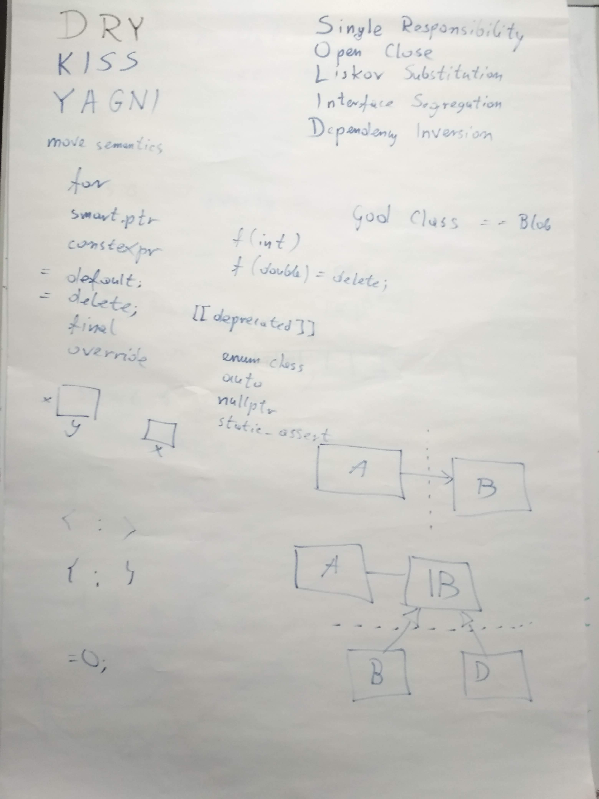
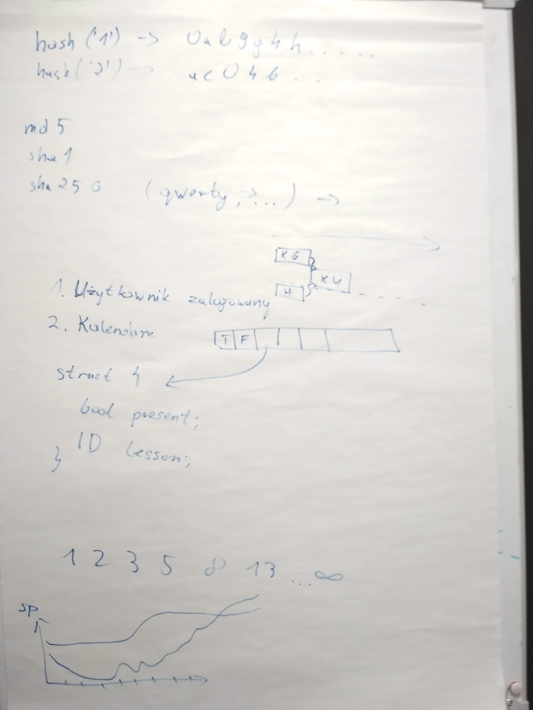
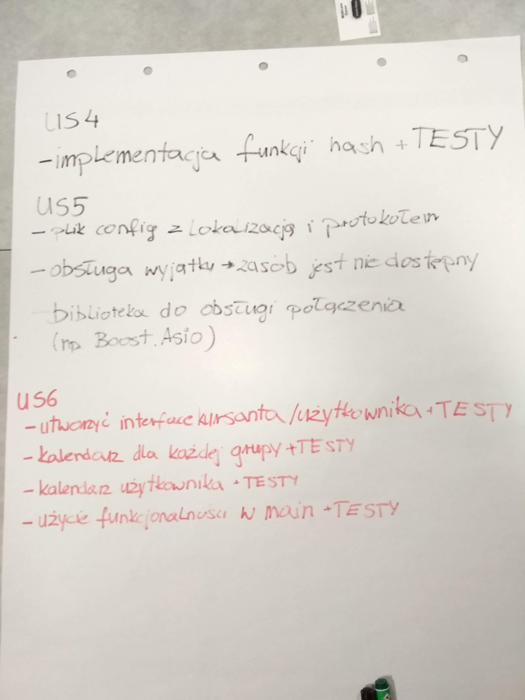
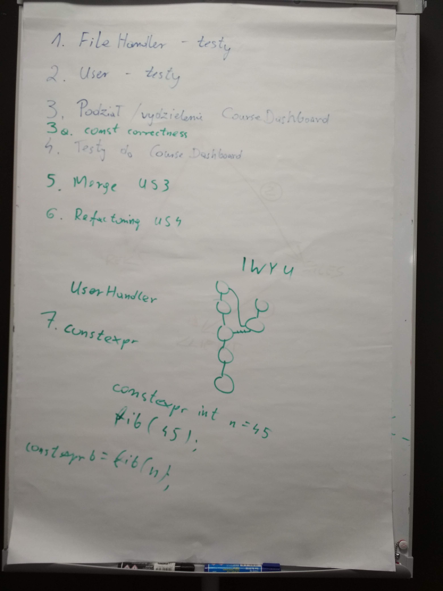
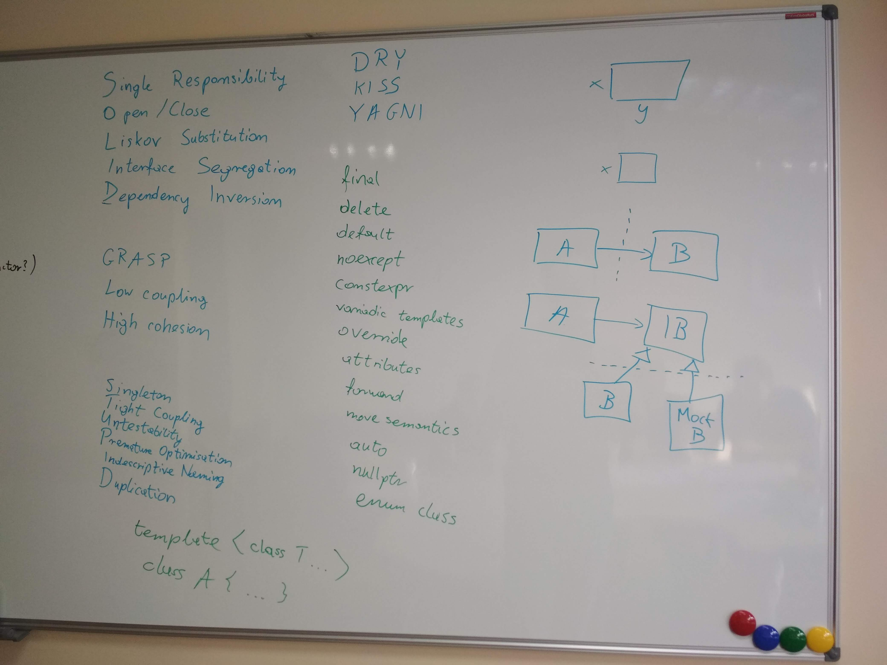
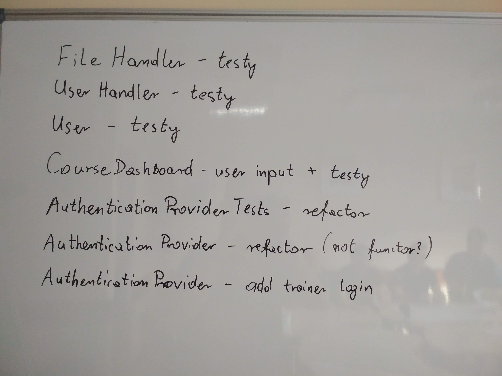
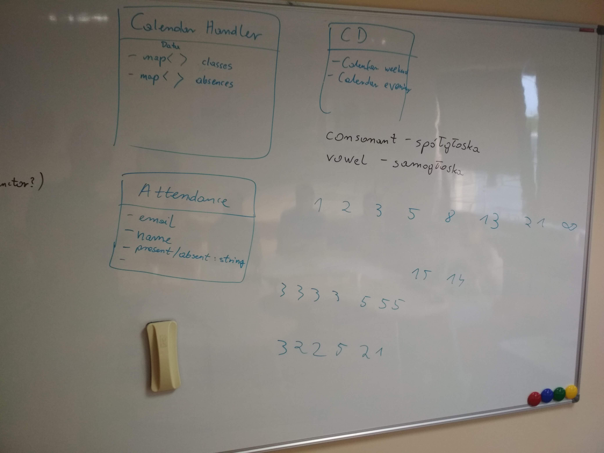
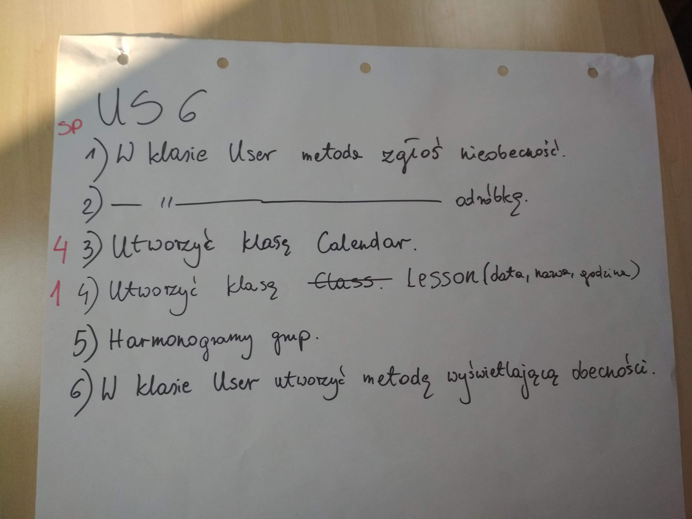

# Kurs-CPP
Materiały z kursu C++ (Lipiec 2019 - Wrzesień 2019)

## Grupa weekendowa

### 07.09.2019 Refactoring Dojo

## Grupa wieczorowa

### 10.09.2019 Refactoring Dojo

### Poprzedni Pre-work

- [x] Brak :)

### Materiały

- [ ] Repo [CourseDashboard](https://github.com/coders-school/CourseDashboard)
- [ ] Opis algorytmu [Soundex](https://en.wikipedia.org/wiki/Soundex)

### Nagrania i foto

#### Grupa weekendowa

-  
   
- [07.09.2019 Powtórka z dobrych praktyki i nowoczesnego C++](https://www.youtube.com/watch?v=ItmUL8lH-j0&list=PLQqoaQUqs4DCoZOgDbqR-KfGSxParz1Pf&index=42)
- [07.09.2019 Planning](https://www.youtube.com/watch?v=1kszZYWjZZg&list=PLQqoaQUqs4DCoZOgDbqR-KfGSxParz1Pf&index=43)
- [07.09.2019 Zadania do zrobienia](https://www.youtube.com/watch?v=VGz2ILtAJBw&list=PLQqoaQUqs4DCoZOgDbqR-KfGSxParz1Pf&index=44)
- [07.09.2019 Coding Dojo - refactoring CourseDashboard](https://www.youtube.com/watch?v=VNp_qhbNNLA&list=PLQqoaQUqs4DCoZOgDbqR-KfGSxParz1Pf&index=45)
  
#### Grupa wieczorowa

-  
   
- [10.09.2019 Powtórka z dobrych praktyk i nowoczesnego C++](https://www.youtube.com/watch?v=ETixmKJtP1g&list=PLQqoaQUqs4DCaFPwa3qfVlJc9YOfZkPAO&index=39)
- [10.09.2019 Planowanie](https://www.youtube.com/watch?v=2MssPK62mpk&list=PLQqoaQUqs4DCaFPwa3qfVlJc9YOfZkPAO&index=40)
- [10.09.2019 Wybór ćwiczenia, rozpiska zadań](https://www.youtube.com/watch?v=omODEtcbieM&list=PLQqoaQUqs4DCaFPwa3qfVlJc9YOfZkPAO&index=41)
- [07.09.2019 Coding Dojo - Soundex](https://www.youtube.com/watch?v=Jj1MdclYfhs&list=PLQqoaQUqs4DCaFPwa3qfVlJc9YOfZkPAO&index=42)

### Post-work

- [ ] (1 punkt / US) Rozpiszcie zadania na kolejne US w projekcie [CourseDashboard](https://github.com/coders-school/CourseDashboard). Za każde rozpisane US jest 1 punkt. Podeślijcie linka do tablicy Kanbanowej na Discordzie wraz ze składem grupy (4-6 osób)

### Pre-work

- [ ] Poczytaj o szablonach i wykonaj zadania z repo [templates](https://github.com/ziobron/templates)
- [ ] Poczytaj o wzorcach projektowych na [sourcemaking.com](https://sourcemaking.com/design_patterns)
- [ ] (25 punktów) Dla chętnych: przygotuj wystąpienie / prezentacje / nagranie / wydruki / dowolną formę przekazu, która streści informacje o wybranym przez Ciebie wzorcu projektowym. Zaprezentuj ją na kolejnych zajęciach. Powinno to trwać ok. 5 minut. Info o tym, który wzorzec wybierzasz wrzuć na Discorda na kanale #szablony-i-wzorce

### Jeszcze kolejny pre-work (powtórka)

- [ ] Przygotuj sobie listę pytań z C++ lub szeroko pojętej inżynierii oprogramowania, na które chcesz poznać odpowiedzi :)
- [ ] (25 punktów) Dla chętnych: przygotuj wystąpienie / prezentacje / nagranie / wydruki / dowolną formę przekazu, która streści jeden z tematów który przerabialiśmy. Zaprezentuj ją na kolejnych zajęciach. Nie powinno to trwać dłużej niż 10 minut.
