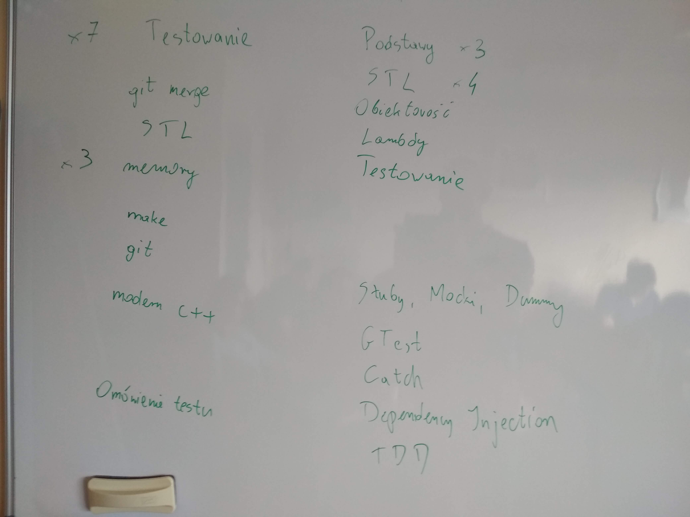
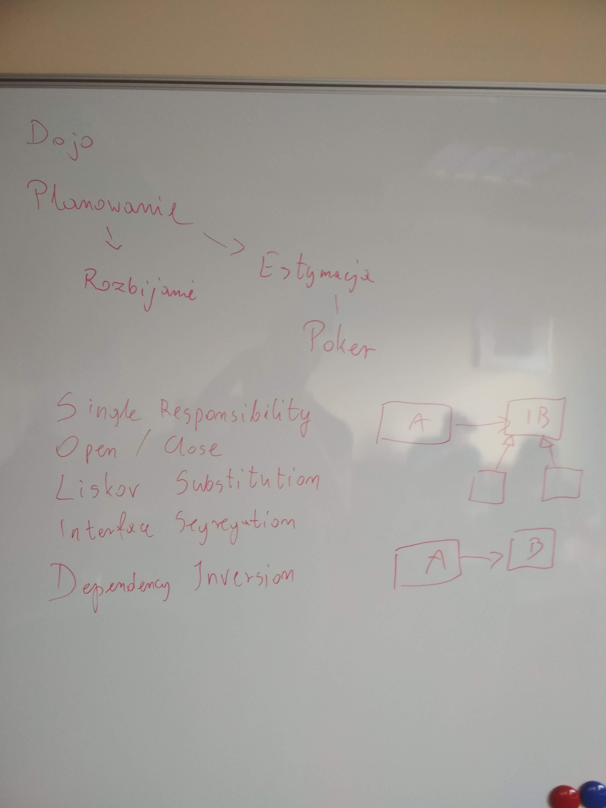
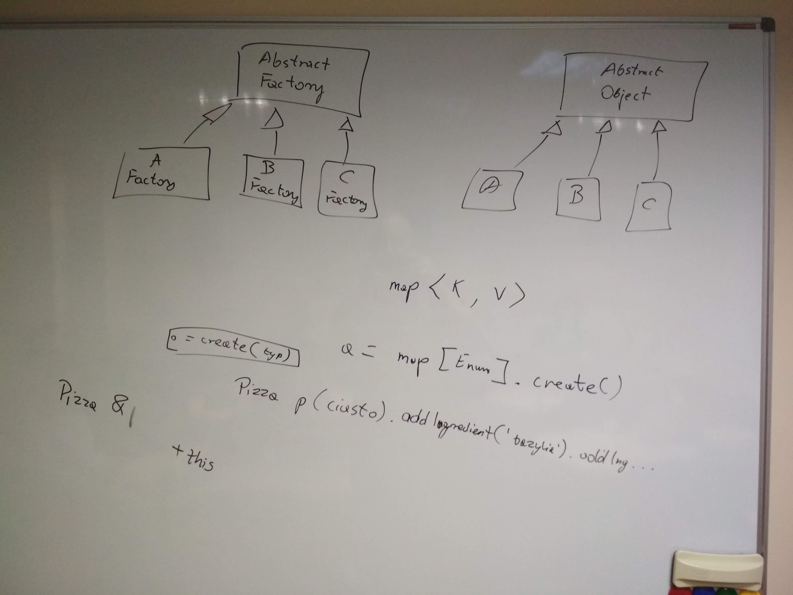
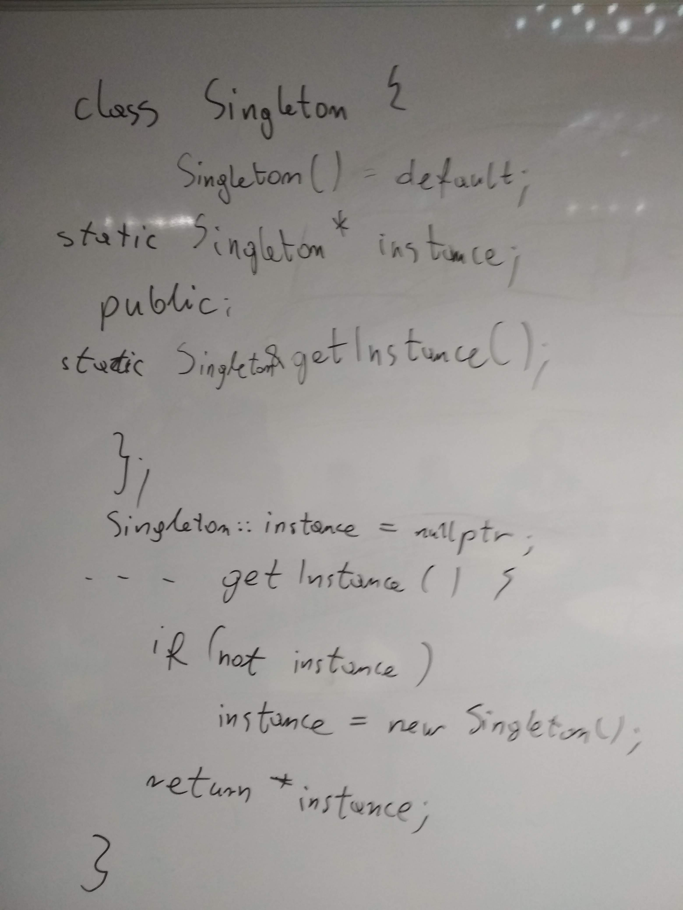
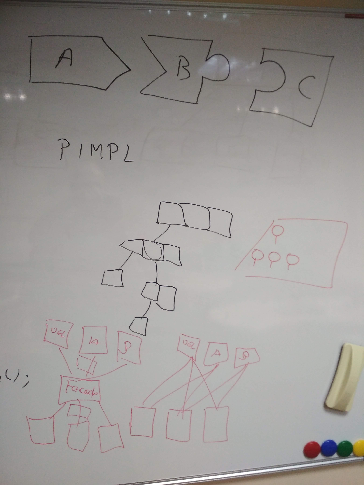

# Kurs-CPP

Materiały z kursu C++ (Lipiec 2019 - Wrzesień 2019)

## Grupa weekendowa

### 14.09.2019 Szablony i wzorce projektowe

## Grupa wieczorowa

### 17.09.2019 Szablony i wzorce projektowe

### Poprzedni Pre-work

- [x] Poczytaj o szablonach i wykonaj zadania z repo [templates](https://github.com/ziobron/templates)
- [x] Poczytaj o wzorcach projektowych na [sourcemaking.com](https://sourcemaking.com/design_patterns)
- [x] (25 punktów) Dla chętnych: przygotuj wystąpienie / prezentacje / nagranie / wydruki / dowolną formę przekazu, która streści informacje o wybranym przez Ciebie wzorcu projektowym. Zaprezentuj ją na kolejnych zajęciach. Powinno to trwać ok. 5 minut. Info o tym, który wzorzec wybierzasz wrzuć na Discorda na kanale #szablony-i-wzorce

### Materiały

- Wzorce projektowe na [sourcemaking.com](https://sourcemaking.com/design_patterns)
- Repo [templates](https://github.com/ziobron/templates)
- Prezentacja [Variadic Templates](variadic_templates.pdf)
- [Materiały powtórkowe poprzednich grup](https://github.com/coders-school/kurs_cpp_zima_2019/tree/master/L13-templates,patterns,repetition/materialy_poprzednich_grup)

### Nagrania i foto

#### Grupa weekendowa
  
#### Grupa wieczorowa

-  
   
  

### Post-work

- [ ] (2 punkty) Wypełnij [ankietę zadowolenia z kursu](https://forms.gle/FaXBgSZBSwbNjyo9A)
- [ ] (2 punkty) Wypełnij [ankietę odnośnie planowanego kursu C++ online w Coders School](https://forms.gle/FKbeyYZhA2tiUBoN8)
- [ ] (1 punkt) Obserwuj/polub nas na [Facebooku](https://www.facebook.com/szkola.coders.school) i [LinkedInie](https://www.linkedin.com/company/coders-school/) :)
- [ ] (10 punktów) Napisz nam opinię na jednym lub kilku z serwisów:

    - [LinkedIn - Łukasz](https://www.linkedin.com/in/lukaszziobron)
    - [LinkedIn - Ihor](https://www.linkedin.com/in/ihor-rudynskyi-86a81b172/)
    - [Facebooku - Coders School](https://www.facebook.com/szkola.coders.school)
    - [Google - Coders School](https://www.google.pl/maps/place/Coders.school/@50.7742468,8.0424075,5z/data=!3m1!4b1!4m5!3m4!1s0x470fc20ffeb98a75:0x9c523147244dbb99!8m2!3d51.1049959!4d17.0086049)

- [ ] (1 punkt) [Zgłoś zainteresowanie kursem z Wielowątkowości w C++](https://coders.school/mini-kursy-cpp/#zainteresowanie). Przewidywany termin - marzec 2020, koszt z rabatem: 750 zł.

### Pre-work

- [ ] Przygotuj sobie listę pytań z C++ lub szeroko pojętej inżynierii oprogramowania, na które chcesz poznać odpowiedzi :)
- [ ] (25 punktów) Dla chętnych: przygotuj wystąpienie / prezentacje / nagranie / wydruki / dowolną formę przekazu, która streści jeden z tematów który przerabialiśmy. Zaprezentuj ją na kolejnych zajęciach. Nie powinno to trwać dłużej niż 10 minut.

### Jeszcze kolejny pre-work

- [ ] Przygotuj swoje CV na kolejne zajęcia. Przynieś je wydrukowane.
- [ ] Przejrzyj w internecie przykładowe pytania z rozmów kwalifikacyjnych i przygotuj sobie te, na które chcesz poznać prawidłowe odpowiedzi :)
- [ ] Przygotuj sobie komentarze odnośnie naszego kursu. Co się podobało, a co moglibyśmy ulepszyć.
- [ ] Jeśli nie jest to dla Ciebie problemem, udostępnij na swoich mediach społecznościowych post Coders School o naszych przyszłych kursach (w przygotowaniu)
